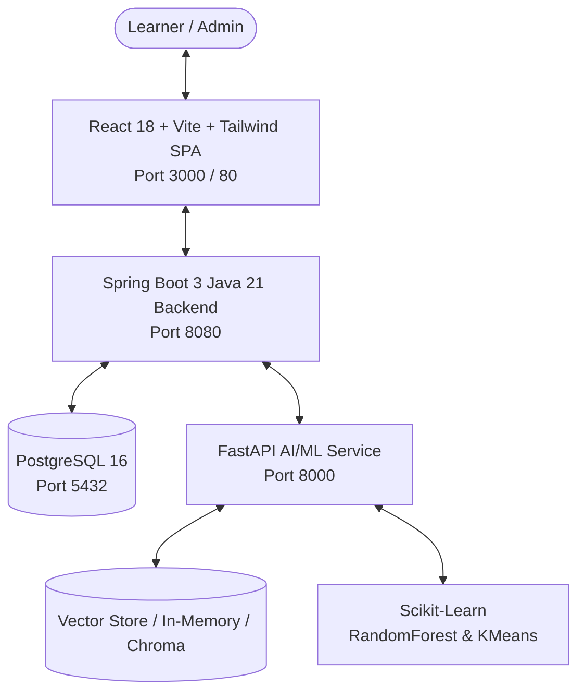

# LearnPath AI — AI-Based Personalized Learning Platform

[](#)
[](#)
[](#)
[](#)
[](#)

LearnPath AI is a production-grade personalized learning ecosystem that combines **adaptive skill assessments**, **prerequisite-based knowledge graph roadmaps**, a **multilingual RAG AI study tutor**, and **scikit-learn recommendation models** (Random Forest & KMeans).

---

## 🏛️ System Architecture



### Monorepo Structure

- **`frontend/`**: Modern React 18 SPA built with Vite, TypeScript, Tailwind CSS, React Router v6, Axios, Lucide Icons, and Recharts.
- **`backend/`**: Enterprise-grade Spring Boot 3 & Java 21 microservice using Spring Data JPA, Spring Security, JWT authentication, and database auto-seeding.
- **`ai-service/`**: Python 3.11 FastAPI microservice implementing PyMuPDF document ingestion, text chunking, semantic vector search, deterministic mock & OpenAI LLM providers, and scikit-learn recommendation engines.
- **`docker-compose.yml`**: Multi-container production deployment orchestration.

---

## 🔑 Quick Demo Credentials (Pre-Seeded)

| Role | Email | Password | Permissions |
| :--- | :--- | :--- | :--- |
| **Student** | `student@example.com` | `Student@123` | Roadmaps, Diagnostic Assessments, Adaptive Quizzes, RAG AI Tutor, Analytics, Study Planner |
| **Admin** | `admin@example.com` | `Admin@123` | Curriculum Management, Course Creation & Publishing, Topic & Question Management |

---

## 🚀 Getting Started

### Option 1: One-Command Docker Compose (Recommended)

1. Clone or navigate to the project directory:
   ```bash
   cd "AI--Based-Personalized-Learning-Platform"
   ```

2. Copy environment template:
   ```bash
   cp .env.example .env
   ```

3. Launch the full stack:
   ```bash
   docker-compose up --build
   ```

4. Access the services:
   - **Web Application**: [http://localhost:3000](http://localhost:3000)
   - **Spring Boot Backend**: [http://localhost:8080](http://localhost:8080)
   - **Swagger API Documentation**: [http://localhost:8080/swagger-ui.html](http://localhost:8080/swagger-ui.html)
   - **FastAPI AI Microservice Docs**: [http://localhost:8000/docs](http://localhost:8000/docs)
   - **PostgreSQL Database**: `localhost:5432` (`learnpath_db`)

---

### Option 2: Local Development Setup

#### 1. PostgreSQL Database
Ensure PostgreSQL is running on port 5432 with database `learnpath_db`, user `learnpath_user`, password `learnpath_secure_password_2026`.

#### 2. Python AI Microservice (`ai-service/`)
```bash
cd ai-service
python -m venv venv
source venv/bin/activate  # On Windows: venv\Scripts\activate
pip install -r requirements.txt
uvicorn app.main:app --host 0.0.0.0 --port 8000 --reload
```

#### 3. Spring Boot Backend (`backend/`)
```bash
cd backend
mvn spring-boot:run
```

#### 4. React Frontend (`frontend/`)
```bash
cd frontend
npm install
npm run dev
```

---

## 🧠 Core Features & Workflows

1. **Adaptive Skill Assessments & Knowledge-Gap Profiling**:
   - Baseline diagnostics evaluate topic proficiencies as `WEAK`, `DEVELOPING`, `PROFICIENT`, or `ADVANCED`.
   - Results auto-generate remedial recommendations and unlock prerequisites.

2. **Prerequisite-Aware Roadmaps**:
   - Visual step-by-step roadmap where topics unlock only when prerequisite topics achieve proficiency.
   - Recommended next topic badge updates in real time based on test performance.

3. **Multilingual RAG AI Study Tutor**:
   - Ingest PDF, TXT, or Markdown documents via PyMuPDF.
   - Chunked semantic indexing and cosine-similarity retrieval.
   - Grounded answering with exact source excerpt citations and page numbers.
   - Supports English, Hindi, and Kannada.

4. **Scikit-Learn Recommendation Engine**:
   - `RandomForestClassifier` predicts learner intervention urgency.
   - `KMeans` clusters students into learning cohorts (struggling, balanced, accelerator).

5. **Learner Analytics & Recharts Visualization**:
   - Diagnostic score trajectories over time.
   - Knowledge level distribution pie charts.
   - Weak topic alerts with targeted remedial actions.
   - Consecutive study streak tracker and active learning minutes counter.

---

## 🔒 Security & Best Practices

- Stateless JWT access tokens (24h) and refresh tokens (7d).
- Passwords salted and hashed with BCrypt.
- Role-based authorization (`ROLE_STUDENT`, `ROLE_ADMIN`).
- Zero secret leak policy: all keys managed through `.env` and environment variables.
- Deterministic local mock AI fallback ensures full offline capability without requiring third-party API keys.
