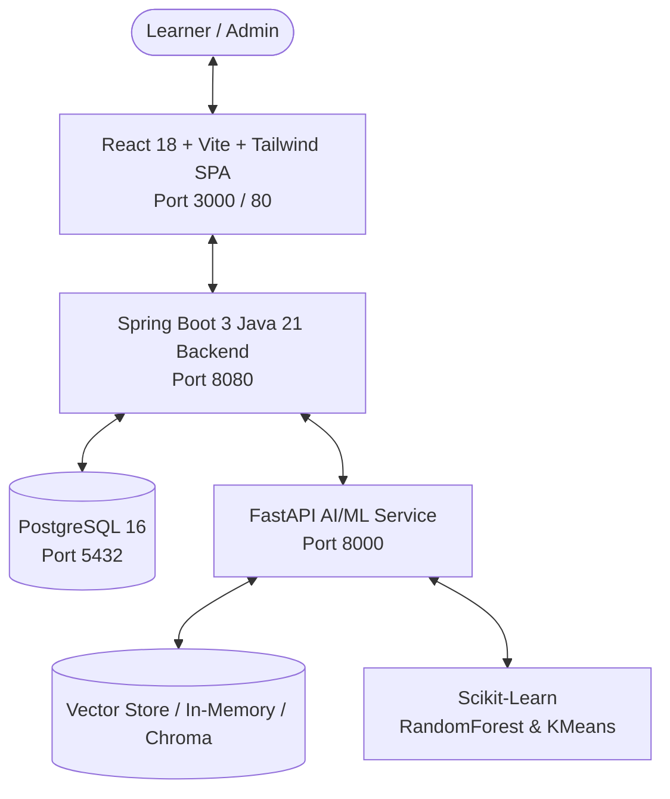

# LearnPath AI — AI-Based Personalized Learning Platform

[](#)
[](#)
[](#)
[](#)
[](#)

LearnPath AI is a production-grade personalized learning ecosystem that combines **adaptive skill assessments**, **prerequisite-based knowledge graph roadmaps**, a **multilingual RAG AI study tutor**, and **scikit-learn recommendation models** (Random Forest & KMeans).

---

## 🏛️ System Architecture


```mermaid
graph TD
    User([Learner / Admin]) <--> Frontend[React 18 + Vite + Tailwind SPA\nPort 3000 / 80]
    Frontend <--> Backend[Spring Boot 3 Java 21 Backend\nPort 8080]
    Backend <--> Postgres[(PostgreSQL 16\nPort 5432)]
    Backend <--> AIService[FastAPI AI/ML Service\nPort 8000]
    AIService <--> VectorStore[(Vector Store / In-Memory / Chroma)]
    AIService <--> MLModels[Scikit-Learn\nRandomForest & KMeans]
```

### Monorepo Structure

- **`frontend/`**: Modern React 18 SPA built with Vite, TypeScript, Tailwind CSS, React Router v6, Axios, Lucide Icons, and Recharts.
- **`backend/`**: Enterprise-grade Spring Boot 3 & Java 21 microservice using Spring Data JPA, Spring Security, JWT authentication, and database auto-seeding.
- **`ai-service/`**: Python 3.11 FastAPI microservice implementing PyMuPDF document ingestion, text chunking, semantic vector search, deterministic mock & OpenAI LLM providers, and scikit-learn recommendation engines.
- **`docker-compose.yml`**: Multi-container production deployment orchestration.

---

## 🔑 Quick Demo Credentials (Pre-Seeded)

| Role | Email | Password | Permissions & Features |
| :--- | :--- | :--- | :--- |
| **Student** | `student@example.com` | `Student@123` | Roadmaps, Diagnostic Assessments, Adaptive Quizzes, RAG AI Tutor, Analytics, Study Planner |
| **Teacher** | `teacher@example.com` | `Teacher@123` | Cohort Performance Telemetry, Score Bell Curves, Concept Bottlenecks, At-Risk Interventions |
| **Admin** | `admin@example.com` | `Admin@123` | Curriculum Management, Course Creation & Publishing, Topic & Question Management |

---

## 🚀 Getting Started

### Option 1: One-Command Docker Compose (Recommended)

1. Clone or navigate to the project directory:
   ```bash
   cd "AI--Based-Personalized-Learning-Platform"
   ```

2. Copy environment template:
   ```bash
   cp .env.example .env
   ```

3. Launch the full stack:
   ```bash
   docker-compose up --build
   ```

4. Access the services:
   - **Web Application**: [http://localhost:3000](http://localhost:3000)
   - **Spring Boot Backend**: [http://localhost:8080](http://localhost:8080)
   - **Swagger API Documentation**: [http://localhost:8080/swagger-ui.html](http://localhost:8080/swagger-ui.html)
   - **FastAPI AI Microservice Docs**: [http://localhost:8000/docs](http://localhost:8000/docs)
   - **PostgreSQL Database**: `localhost:5432` (`learnpath_db`)

---

### Option 2: Local Development Setup

#### 1. PostgreSQL Database
Ensure PostgreSQL is running on port 5432 with database `learnpath_db`, user `learnpath_user`, password `learnpath_secure_password_2026`.

#### 2. Python AI Microservice (`ai-service/`)
```bash
cd ai-service
python -m venv venv
source venv/bin/activate  # On Windows: venv\Scripts\activate
pip install -r requirements.txt
uvicorn app.main:app --host 0.0.0.0 --port 8000 --reload
```

#### 3. Spring Boot Backend (`backend/`)
```bash
cd backend
mvn spring-boot:run
```

#### 4. React Frontend (`frontend/`)
```bash
cd frontend
npm install
npm run dev
```

---

---

## 🌟 The Complete 20 AI Features Suite

LearnPath AI delivers a comprehensive, production-grade ecosystem covering all 20 key capabilities:

| # | Feature | What it adds to your project | Live Route / Component | Architecture Implementation |
|---|---|---|---|---|
| **1** | **AI-Powered Learning Recommendations** | Recommends courses/topics based on the student's performance and interests | [`/recommendations`](file:///frontend/src/pages/RecommendationsPage.tsx) | `RecommendationService.java`, `ml_routes.py` (Scikit-Learn RandomForest & KMeans) |
| **2** | **Personalized Learning Path** | Automatically creates a study plan for each student | [`/study-plan`](file:///frontend/src/pages/StudyPlanPage.tsx), [`/study-planner`](file:///frontend/src/pages/StudyPlannerPage.tsx) | `StudyPlanService.java`, `StudyPlannerService.java`, milestone calendar generation |
| **3** | **AI Quiz Generator** | Generates quizzes/questions from uploaded study material | [`/summarizer`](file:///frontend/src/pages/DocSummarizerPage.tsx) | `DocumentAiController.java`, `generator_routes.py`, grounded MCQs with full explanations |
| **4** | **Adaptive Difficulty** | Increases/decreases question difficulty based on performance | [`/quiz/adaptive`](file:///frontend/src/pages/AdaptiveQuizPage.tsx) | `AdaptiveQuizService.java`, 3-tier dynamic calibration based on consecutive answers |
| **5** | **Performance Prediction** | Predicts student performance using ML | [`/behavior`](file:///frontend/src/pages/BehaviorPredictionPage.tsx) | `LearningBehaviorService.java`, `behavior_routes.py`, struggle probability & burnout risk |
| **6** | **AI Tutor / Chatbot** | Allows students to ask questions and receive personalized explanations | [`/tutor`](file:///frontend/src/pages/TutorPage.tsx), [`/mentor`](file:///frontend/src/pages/MentorPage.tsx) | RAG vector store retrieval, source citations, Socratic coaching personas |
| **7** | **Multilingual Support** | Provides learning content and explanations in multiple languages | Top Navbar language switcher | `LanguageContext.tsx`, translations in English, Hindi (हिन्दी), and Kannada (ಕನ್ನಡ) |
| **8** | **Voice-Based Learning** | Speech-to-text and text-to-speech interaction | [`/voice-tutor`](file:///frontend/src/pages/VoiceTutorPage.tsx) | `VoiceController.java`, `voice_routes.py`, Web Audio MediaRecorder & SpeechSynthesis |
| **9** | **Weak-Topic Detection** | Identifies subjects/topics where the student is struggling | [`/dashboard`](file:///frontend/src/pages/DashboardPage.tsx), [`/early-warning`](file:///frontend/src/pages/EarlyWarningPage.tsx) | `AnalyticsService.java`, mastery gap classification (`WEAK`, `DEVELOPING`), 1-click remediation |
| **10** | **Progress Dashboard** | Shows scores, progress, strengths, weaknesses and learning time | [`/dashboard`](file:///frontend/src/pages/DashboardPage.tsx) | Active learning minutes tracking, average scores, strength matrix, and weak-topic detection |
| **11** | **Recommendation Engine** | Suggests videos, courses, notes and practice questions | [`/recommendations`](file:///frontend/src/pages/RecommendationsPage.tsx) | Multi-category suggestions (Videos, Courses, Study Notes, Adaptive Practice) |
| **12** | **Gamification** | Points, badges, levels, streaks and leaderboards | [`/gamification`](file:///frontend/src/pages/GamificationPage.tsx) | `GamificationService.java`, XP ledger, tiers (Novice to Master), streaks, unlockable badges |
| **13** | **Teacher/Admin Dashboard** | Allows teachers to monitor student performance | [`/teacher-dashboard`](file:///frontend/src/pages/TeacherDashboardPage.tsx), [`/admin`](file:///frontend/src/pages/AdminDashboardPage.tsx) | Cohort score bell curves, concept bottlenecks, early warnings, one-click interventions |
| **14** | **Automated Feedback** | Gives AI-generated feedback after quizzes/assignments | [`/assignments`](file:///frontend/src/pages/AssignmentPage.tsx), [`/quiz/adaptive`](file:///frontend/src/pages/AdaptiveQuizPage.tsx) | Rubric evaluations, scored criterion breakdowns, quoted evidence, instant quiz explanations |
| **15** | **Learning Analytics** | Analyzes student behavior and learning patterns | [`/analytics`](file:///frontend/src/pages/AnalyticsPage.tsx) | Recharts interactive dashboards, quiz score trends, retention radar, mastery distribution |
| **16** | **Resume/Certificate Generation** | Generates certificates after completing courses & Resume Analyzer | [`/certificates`](file:///frontend/src/pages/CertificatesPage.tsx), [`/resume-analyzer`](file:///frontend/src/pages/ResumeAnalyzerPage.tsx) | Cryptographic SHA-256 hash verifiable certificates (`/verify/:id`) and skill-gap analyzer |
| **17** | **Cloud Database** | Stores user profiles, progress and learning history | `PostgreSQL 16` / `application.yml` | Spring Data JPA, Hibernate DDL, Supabase / AWS RDS / Neon / Railway cloud compatibility |
| **18** | **Authentication & Authorization** | Student/Teacher/Admin roles with secure login | [`/login`](file:///frontend/src/pages/LoginPage.tsx), [`/register`](file:///frontend/src/pages/RegisterPage.tsx) | JWT authentication filter, BCrypt salted hashing, `ROLE_STUDENT`, `ROLE_TEACHER`, `ROLE_ADMIN` |
| **19** | **Mobile Application** | Extends the platform to Android/iOS | [`capacitor.config.json`](file:///frontend/capacitor.config.json), `manifest.json` | Responsive Tailwind SPA, PWA install prompt, Capacitor Android & iOS native builds |
| **20** | **AI Content Summarization** | Converts lengthy notes/PDFs into concise study material | [`/summarizer`](file:///frontend/src/pages/DocSummarizerPage.tsx) | PyMuPDF parsing, executive synthesis, key conceptual invariants, interactive flashcards |

---

## 📱 Mobile Application Deployment (Android & iOS)

The frontend is fully responsive, PWA-enabled, and configured for Capacitor native mobile builds:

### 1. Progressive Web App (PWA)
- Automatic install banner prompts on Android Chrome and iOS Safari.
- Offline static caching with service worker (`sw.js`).
- Standalone app-like windowing via `manifest.json`.

### 2. Native Android / iOS Build with Capacitor
```bash
cd frontend
npm install @capacitor/core @capacitor/cli @capacitor/android @capacitor/ios
npm run build

# Add Android native project
npx cap add android
npx cap open android  # Opens in Android Studio to build APK/Bundle

# Add iOS native project (macOS)
npx cap add ios
npx cap open ios      # Opens in Xcode
```

---

## ☁️ Cloud Database Configuration (PostgreSQL / Supabase / Neon / AWS RDS)

To point the backend to an external cloud database, simply provide your connection string in `.env` or as environment variables:

```bash
# Example: Neon / Supabase / AWS RDS PostgreSQL URI
SPRING_PROFILES_ACTIVE=prod
SPRING_DATASOURCE_URL=jdbc:postgresql://<your-cloud-db-host>:5432/learnpath_db?sslmode=require
SPRING_DATASOURCE_USERNAME=<your-db-username>
SPRING_DATASOURCE_PASSWORD=<your-db-password>
```

---

## 🔒 Security & Best Practices

- Stateless JWT access tokens (24h) and refresh tokens (7d).
- Passwords salted and hashed with BCrypt.
- Role-based authorization (`ROLE_STUDENT`, `ROLE_TEACHER`, `ROLE_ADMIN`).
- Zero secret leak policy: all keys managed through `.env` and environment variables.
- Comprehensive AI audit logging (`AIAuditService`) capturing model version, prompt ID, latency, user ID, and correlation IDs.
- Deterministic local mock AI fallback ensures full offline capability without requiring third-party API keys.


